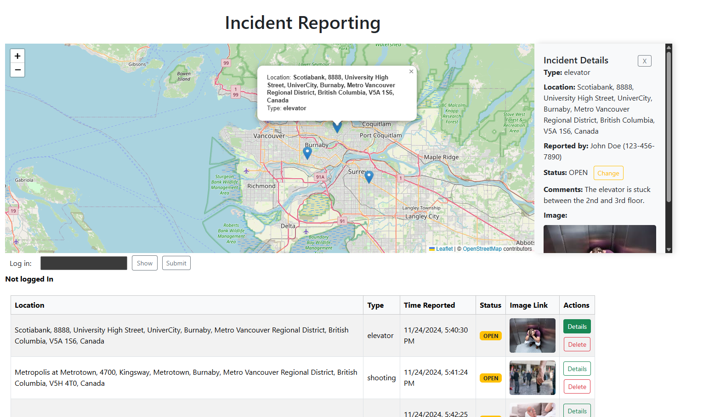
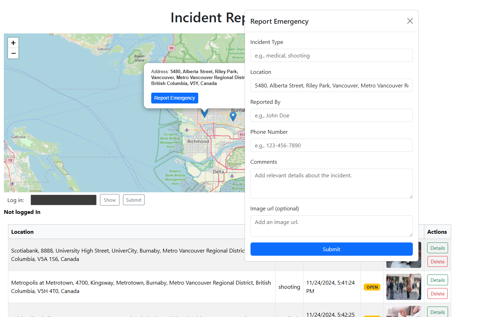

# Emergency Incident Reporting Platform - A Web Based Emergency Reporting App 🚨

This is a web-based emergency reporting system designed for public and first responder use. It allows civilians to report emergencies with real-time location tagging and lets operators manage and monitor reports through a map-based interface.

This project was built using **React**, **JavaScript/TypeScript**, **Bootstrap**, and **Leaflet with OpenStreetMaps**, along with client-side storage APIs. It provides a seamless, fully client-side experience without requiring a backend server.

---

## 🌟 Features

- 📍 **Map-Based Reporting:** View all emergency reports on an interactive map.
- 🔍 **List View + Map Sync:** See a sortable list of reports that syncs with map zoom and position.
- 🧭 **Marker & List Interaction:** Click on a report to view full details and highlight it on the map.
- 🛠 **Secure Report Management:** Modify or delete reports using a passcode (MD5 hashed).
- 🖼 **Optional Media & Details:** Attach a picture and comments to give responders more context.
- 💾 **Fully Client-Side:** All data is stored locally using DOM Storage — no server needed.
- 📱 **Responsive UI:** Built with Bootstrap for a clean and responsive user interface.

---

## 🔐 Passcode Management

The system requires a passcode to **edit** or **delete** emergency reports.

- All passcodes are stored as **MD5 hashes** in a dedicated JSON file: [`password_store.json`](./src/storage/password_store.json) (Initially contains MD5 hash of "password").
- The app verifies input by hashing the user’s passcode and comparing it to this list.
- To **add or remove** passcodes, use the provided CLI script:

### ➕ Add a passcode

```bash
#Go to src/storage
cd src/storage

#Add a password to password_store
node hash_pass.js add yourPasscodeHere
```

### ➖ Remove a passcode

```bash
#Go to src/storage
cd src/storage

#Remove a password from password_store
node hash_pass.js remove yourPasscodeHere
```

> _All passwords are hashed using the MD5 algorithm before being stored. Only hashed values are kept in the JSON file — plain-text passwords are never saved._

---

## 🗺️ Technologies Used

- **Frontend:** React, TypeScript, JavaScript, Bootstrap
- **Maps:** [Leaflet](https://leafletjs.com/) for interactive mapping and markers
- **Geocoding:** [Maps.co Reverse Geocoding API](https://geocode.maps.co/) to convert coordinates into human-readable addresses  
  👉 *You'll need a free API key from [maps.co](https://geocode.maps.co/) to enable address lookup.*
- **Storage:** DOM Storage API (`localStorage`) for saving reports on the client
- **Security:** MD5 hashing for passcode verification (via `md5` package)
- **Dev Tools:** Vite for fast local development and build process

---

## 📸 Screenshots

> _Include one or more screenshots or animated GIFs here to visually demonstrate how the app works._

Incident Details:



Add a new incident:



## 🚀 Getting Started

### Prerequisites

- [Node.js](https://nodejs.org/)

> All other required packages — including React, Vite, and dependencies — will be automatically installed via:

```bash
npm install
```

### Setup Instructions

```bash
# Clone the repository
git clone https://github.com/vishykum/Emergency-Incident-Reporting-Platform.git

# Navigate into the project directory
cd Emergency-Incident-Reporting-Platform

# Install dependencies
npm install

# Start the development server
npm run dev
